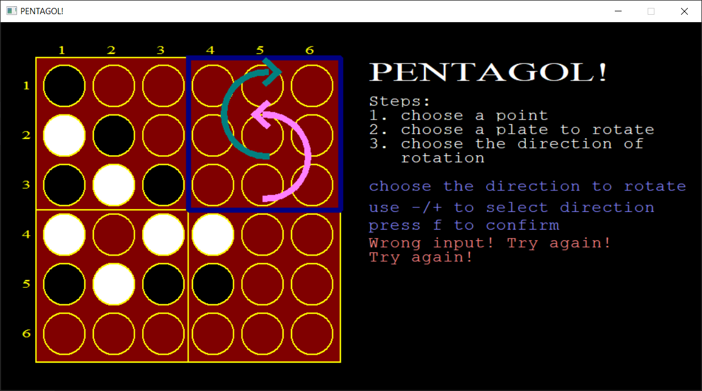
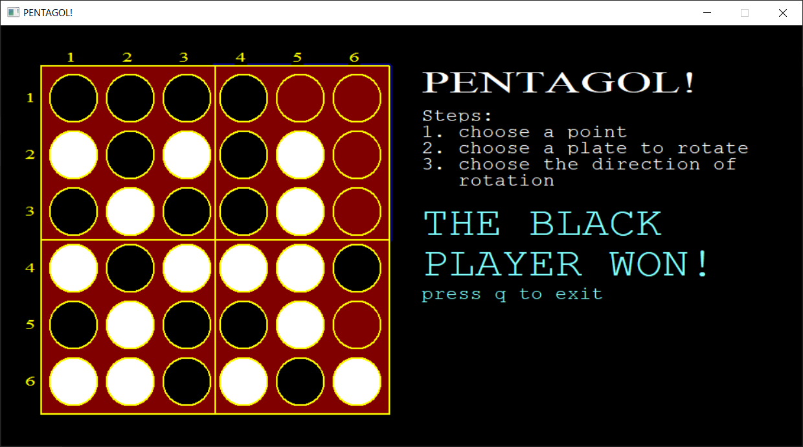

# DaniPenta Game

## Computer Assignment 1
Introduction to Computing Systems and Programming

Faculty of Engineering

School of Electrical and Computer Engineering

University of Tehran

## Screenshots

## Usage

### CLI Version
For CLI Version just compile `main.c` using Microsoft Visual Studio.

### GUI Version
For GUI Version, 
1. Download WinBGIm from [here](https://www.cs.colorado.edu/~main/bgi/visual/).
2. Extract .zip file and open `bgi.sln` file in Microsoft Visual Studio. 
3. Create each file manually! (because of VS!) 
4. Hit `F5`.
5. Enjoy!
